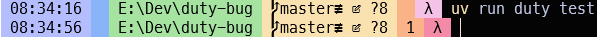
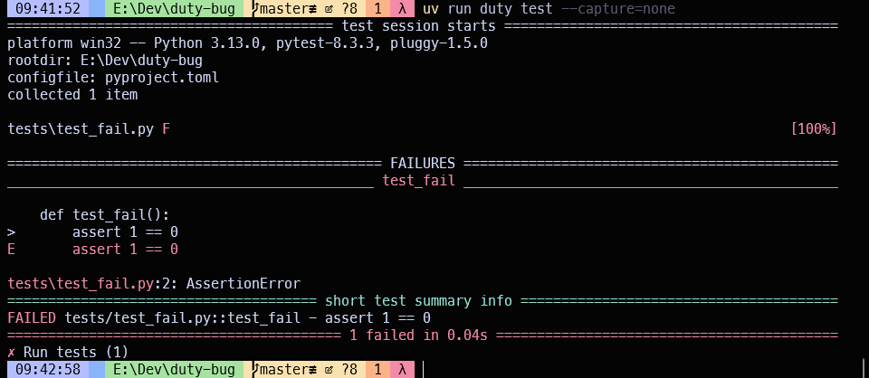

On Windows, duty only prints output if `--capture=none` is used. Tried on Windows 10 and 11.
Repeatable when run in Windows Terminal with PowerShell 7, or the vanilla `cmd` terminal,
and whether I run using `uv` or by activating a `.venv`.

```powershell
λ  uv run duty --debug-info
- __System__: Windows-10-10.0.19045-SP0
- __Python__: cpython 3.13.0 (E:\Dev\duty-bug\.venv\Scripts\python.exe)
- __Environment variables__:
- __Installed packages__:
  - `duty` v1.4.2
```

See [duties.py](duties.py):

```python
from duty import duty, tools


@duty
def test(ctx):
    ctx.run(
        tools.pytest("tests"), title="Run tests")


@duty
def format(ctx):
    ctx.run(tools.ruff(["format", "--check", "."]), title="Check format")
```

When I run the `test` duty with failing tests
```
 uv run duty test
```
I see no output:



Even though the command exited with error code 1 (that's what the "1" in the orange band of my prompt means).

Same with `--capture={both,stdin,stderr}`. But 

```
 uv run duty test --capture=none
```

Reports the errors:



Similar results for `uv run duty format`, except that 

```
uv run duty format
```

exits with error code **120** but

```
uv run duty format --capture=none
```

prints the output and exits with error code 1 (like both flavours of running the `test` duty).


If I activate the `.venv` and run 
```
failprint pytest
```

The output is shown.